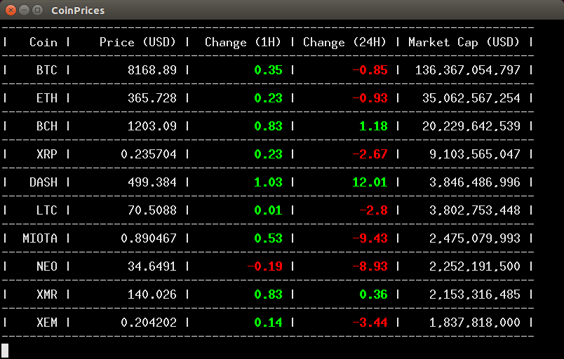

[](https://travis-ci.org/0xmohit/CoinPrices)

## CoinPrices

Get cryptocurrency prices on terminal.



Uses data from [CoinMarketCap API](https://coinmarketcap.com/api/).

### Obtaining

    go get github.com/0xmohit/CoinPrices

### Usage

```
Usage of ./CoinPrices:
  -currency string
        Currency for price and market cap data.
        Valid currencies are: USD, AUD, BRL, BGN, CAD, CHF, CLP, CNY, CZK, DKK, EUR, GBP, HKD, HUF, IDR, ILS, INR, JPY, KRW, MXN, MYR, NOK, NZD, PHP, PKR, PLN, RUB, SEK, SGD, THB, TRY, TWD, ZAR (default "USD")
  -limit uint
        Default number of currencies. (default 10)
```

By default, `CoinPrices` limits the number of currencies to 10 and displays the
currency data in USD.

The quotes are refreshed every 5 minutes.
